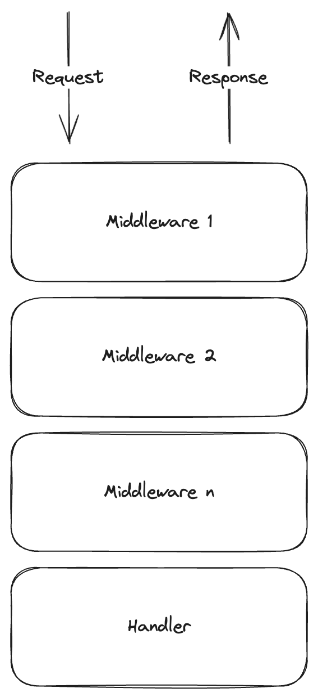
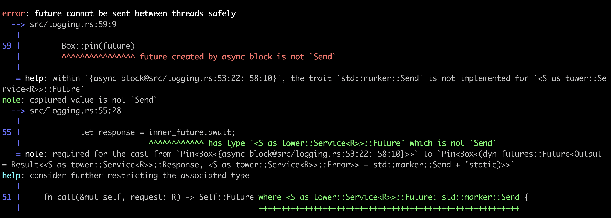
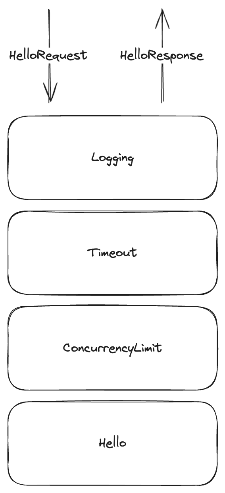

<!-- _class: deck-title -->

# A Deep Dive into Tower
## `async fn(Req) -> Result<Resp, Error>`

---

<!-- _class: normal -->

# Hello 👋

- Adrien Guillo ([@guilload](https://github.com/guilload))
- Developing in Rust for ~3 years, mostly contributing to [Quickwit](https://github.com/quickwit-oss/quickwit)
- Slides at [guilload.com/fosdem-2024](https://guilload.com/fosdem-2024)

<!--
Quickwit = OSS distributed search engine for logs and traces,

talk tomorrow (Monitoring & Observability devroom)
-->

---

<!-- _class: normal -->

# What is Tower?

- crate for building __modular__ networking clients and servers
- widely used within the Rust ecosystem (`axum`, `warp`, `tonic`, ...)
- based on the __`Service`__ trait

---

<!-- _class: normal -->

# Why do we need Tower?

*In an imaginary dynamic language, we could write this...*

<br>

```python
def get_user(request):
    logging.info(f"started processing request {request.method} {request.path}")
    user = Users.get(request.username)
    response = Response.ok(user)
    logging.info("finished processing request")
    response
```

---

<!-- _class: normal -->

*However, it would be better to write that...*

<br>

```python
def with_logging(handler)(request):
    logging.info(f"started processing request {request.method} {request.path}")
    response = handler(request)
    logging.info("finished processing request")
    response

def get_user(request):
    user = Users.get(request.username)
    Response.ok(user)

get_user_with_logging = with_logging(get_user)
```

---

<!-- _class: normal -->

*We want to write __generic__ and __reusable__ functions that are easy to __compose__.*

---

<!-- _class: normal -->

# Decorator pattern

- A function that wraps a function
- Applies additional behavior before or after the inner function
- In the context of clients and servers, often called __middlewares__

<br>

```python
def with_behavior(handler)(request):
    # Insert behavior before processing the request...
    response = handler(request)
    # and/or after processing the request.
    response
```

<!--
- wrapped function is opaque

- wrapped function remains unaffected by decorators
-->

---

<!-- _class: normal -->



---

<!-- _class: normal -->

Fairly easy to implement with dynamic languages:
- duck typing gives us great **flexibility**
- decorated functions must **agree implicitly** on their input and output types

---

<!-- _class: title -->

# How can we compose functions in a __type-safe and flexible__ manner in Rust?

---

<!-- _class: normal -->

# The `tower::Service` trait

Allows implementing components in a **protocol-agnostic and composable** way.

<br>

```rust
pub trait Service<Request> {
    type Response;
    type Error;
    type Future: Future<Output = Result<Self::Response, Self::Error>>;

    fn poll_ready(&mut self, cx: &mut Context<'_>) -> Poll<Result<(), Self::Error>>;

    fn call(&mut self, req: Request) -> Self::Future;
}
```

<!--
Tower service trait = common interface

1 type parameter:
  - `Request`: any type

3 associated types:
  - `Response`: any type
  - `Error`: any type, not even `std::error::Error`
  - `Future`: must implement `Future`

- `Output`, the associated type of `Future` is fixed at Result<Self::Response, Self::Error>

- Means that you can choose the type of the `Future`, but you can't choose its return type
-->

---

<!-- _class: normal -->

*“Just” a __generic async function__*

<br>

```rust
/// Processes a request and returns a response asynchronously.
async fn call(&mut self, request: Request) -> Result<Response, Error>;
```

<!--
- Defines a generic async function from some type `Request` to some `Result<Response, Error>`
-->

---

<!-- _class: normal -->

*“Just” a __generic async function__... with a twist!*

<br>

```rust
fn poll_ready(&mut self, cx: &mut Context<'_>) -> Poll<Result<(), Self::Error>>;
```

<br>

- `poll_ready` must be called before `call`
- provides a way to propagate backpressure

<!--
- returns `Poll::Ready(Ok(()))` when the service is able to process requests.

- returns `Poll::Pending` if the service is at capacity and the task is notified when the service becomes ready again.
-->

---

<!-- _class: normal -->

A `poll_ready` implementation for a service without external dependencies:

<br>

```rust
fn poll_ready(&mut self, cx: &mut Context<'_>) -> Poll<Result<(), Self::Error>> {
    Poll::Ready(Ok())
}
```

---

<!-- _class: normal -->

A `poll_ready` implementation for a service with a database dependency:

<br>

```rust
fn poll_ready(&mut self, cx: &mut Context<'_>) -> Poll<Result<(), Self::Error>> {
    if self.conn_opt.is_none() {
        self.conn_opt = Some(futures::ready!(self.pool.poll_acquire(cx))?);
    }
    Poll::Ready(Ok())
}
```

<!--

- Then consume the connection with `take` in `call`

- Disarm issue

-->

---

<!-- _class: normal -->

A `poll_ready` implementation for a middleware:

<br>

```rust
fn poll_ready(&mut self, cx: &mut Context<'_>) -> Poll<Result<(), Self::Error>> {
    self.inner.poll_ready(cx)
}
```

---

<!-- _class: normal -->

# It sounds simple on paper, so why does it get complex?

- Lots of generics
- Rust idiosyncrasies (lifetimes, `Send` + `Sync` marker traits, ...)
- Exposure to advanced concepts such as future polling or pinning

<!--
Lots of generic: not always easy to read and even harder to write

Rust idiosyncrasies: it's hard to write services without being comfortable with lifes, `Send`, `Sync` market trait, and many other Rust concepts

No free lunch:
generics -> flexible abstractions
idiosyncrasies -> control, safety, and performance
-->

---

<!-- _class: normal -->

> “The best way out is always through.”

Robert Frost

---

<!-- _class: normal -->

# Let's implement a `Hello` service!

<br>

```rust
#[derive(Debug)]
struct HelloRequest(String);

#[derive(Debug)]
struct HelloResponse(String);

async fn hello(request: HelloRequest) -> HelloResponse {
    let message = format!("Hello, {}!", request.0);
    HelloResponse(message)
}
```

---

<!-- _class: normal -->

*We define a `Hello` struct and start implementing `Service` for it:*

<br>

```rust
#[derive(Debug)]
struct Hello;

impl Service<HelloRequest> for Hello {
    type Response = HelloResponse;
    type Error = Infallible;
    type Future = ?;

    ...
}
```

---


<!-- _class: normal -->

# Choosing a `Future` type

1. **Boxed future**

<br>

For instance, `futures::future::BoxFuture`:

```rust
type BoxFuture<'a, T> = Pin<Box<dyn Future<Output = T> + Send + 'a>>;
```

---

<!-- _class: normal -->

# Why choosing a boxed `Future`?

Pros:
- easy
- readable
- flexible

Cons:
- allocation
- dynamic dispatch

<br>

Good choice for applications, less for libraries

---

<!-- _class: normal -->

*We opt for `BoxFuture`:*

<br>

```rust
impl Service<HelloRequest> for Hello {
    type Response = HelloResponse;
    type Error = Infallible;
    type Future = BoxFuture<'static, Result<Self::Response, Self::Error>>;

    ...
}
```

---

<!-- _class: normal -->

*We start implementing `poll_ready`:*

<br>

```rust
impl Service<HelloRequest> for Hello {
    type Response = HelloResponse;
    type Error = Infallible;
    type Future = BoxFuture<'static, Result<Self::Response, Self::Error>>;

    fn poll_ready(&mut self, _cx: &mut Context<'_>) -> Poll<Result<(), Self::Error>> {
        Poll::Ready(Ok(()))
    }
}
```

---

<!-- _class: normal -->

*Finally, we implement `call`:*

<br>

```rust
impl Service<HelloRequest> for Hello {
    type Response = HelloResponse;
    type Error = Infallible;
    type Future = BoxFuture<'static, Result<Self::Response, Self::Error>>;

    fn call(&mut self, request: HelloRequest) -> Self::Future {
        let future = async move {
            let message = format!("Hello, {}!", request.0);
            HelloResponse(message)
        };
        Box::pin(future)
    }
}
```

<!--
When you spawn a task on the Tokio runtime, its type's lifetime must be 'static.
-->

---

<!-- _class: normal -->

```rust
#[cfg(test)]
mod tests {
    use super::*;
    use tower::ServiceExt;

    #[tokio::test]
    async fn test_hello_service() {
        let response = Hello
            .ready()
            .await
            .unwrap()
            .call(HelloRequest("Alice".to_string()))
            .await
            .unwrap();
        assert_eq!(response.0, "Hello, Alice!");
    }
}
```

---

<!-- _class: normal -->

# Choosing a `Future` type

1. Boxed future
2. **Reuse named future from third-party crate (`futures`, `tower`)**

<br>

For instance, `futures::future::Ready`.

<!-- A bit anecdotical, but I wanted to mention it. -->

---

<!-- _class: normal -->

```rust
use futures::future::{ready, Ready};

impl Service<HelloRequest> for Hello {
    type Response = HelloResponse;
    type Error = Infallible;
    type Future = Ready<Result<Self::Response, Self::Error>>;

    fn call(&mut self, request: HelloRequest) -> Self::Future {
        let message = format!("Hello, {}!", request.0);
        let response = HelloResponse(message);
        ready(response)
    }
}
```

---

<!-- _class: normal -->

# Let's implement a `Logging` service!

*`Logging` decorates an inner service `S`:*

<br>

```rust
#[derive(Debug)]
pub struct Logging<S> {
    inner: S
}
```

---

<!-- _class: normal -->

*We start implementing `Service` for `Logging`:*

<br>

```rust
impl<S, R> Service<R> for Logging<S>
where
    S: Service<R>, // The inner service must be a `Service`.
{
    ...
}
```

---

<!-- _class: normal -->

*Then, we implement `poll_ready`:*

<br>

```rust
impl<S, R> Service<R> for Logging<S>
where
    S: Service<R>,
{
    type Response = S::Response;
    type Error = S::Error;
    type Future = BoxFuture<'static, Result<Self::Response, Self::Error>>;

    fn poll_ready(&mut self, cx: &mut Context<'_>) -> Poll<Result<(), Self::Error>> {
        self.inner.poll_ready(cx)
    }
}
```

---

<!-- _class: normal -->

*Finally, we implement `call`:*

```rust
impl<S, R> Service<R> for Logging<S>
where
    S: Service<R>,
{
    type Response = S::Response;
    type Error = S::Error;
    type Future = BoxFuture<'static, Result<Self::Response, Self::Error>>;

    fn call(&mut self, request: R) -> Self::Future {
        let inner_future = self.inner.call(request);
        let outer_future = async move {
            tracing::info!("started processing request");
            let response = inner_future.await;
            tracing::info!("finished processing request");
            response
        };
        Box::pin(outer_future)
    }
}
```

---

<!-- _class: normal -->

It should work...

<br>

<style>
img[alt~="center"] {
  display: block;
  margin: 0 auto;
}
</style>



---

<!-- _class: normal -->

*`BoxFuture` is `Send + 'static` so `S::Future` must be too.*

<br>

```rust
impl<S, R> Service<R> for Logging<S>
where
    S: Service<R>,
    S::Future: Send + 'static, // We added the constraints `Send + 'static` here.
{
    ...
}
```

---

<!-- _class: normal -->

```rust
#[cfg(test)]
mod tests {
    use super::*;
    use tower::ServiceExt;

    #[tokio::test]
    async fn test_logging_service() {
        let mut service = Logging {
            inner: Hello,
        };
        let response = service
            .ready()
            .await
            .unwrap()
            .call(HelloRequest("Alice".to_string()))
            .await
            .unwrap();
        assert_eq!(response.0, "Hello, Alice!");
    }
}
```

---

<!-- _class: normal -->

# Choosing a `Future` type

1. Boxed future
2. Reuse named future from third-party crate (`futures`, `tower`)
3. **Roll our own `Future`**

---

<!-- _class: normal -->

# Rolling our own `Future`

<br>

```rust
use pin_project::pin_project;

#[pin_project]
pub struct LoggingFuture<F> {
    #[pin]
    inner: F,
}
```

---

<!-- _class: normal -->

# Rolling our own `Future`

```rust
impl<S, R> Service<R> for Logging<S>
where
    S: Service<R>,
    S::Future: Send + 'static,
{
    type Response = S::Response;
    type Error = S::Error;
    type Future = LoggingFuture<S::Future>;

    fn call(&mut self, request: R) -> Self::Future {
        tracing::info!("started processing request");

        LoggingFuture {
            inner: self.inner.call(request),
        }
    }
}
```

---

<!-- _class: normal -->

# Rolling our own `Future`

```rust
impl<F> Future for LoggingFuture<F>
where
    F: Future,
{
    type Output = F::Output;

    fn poll(self: Pin<&mut Self>, cx: &mut Context<'_>) -> Poll<Self::Output> {
        let this = self.project();
        let polled: Poll<_> = this.inner.poll(cx);

        if polled.is_ready() {
            tracing::info!("finished processing request");
        }
        polled
    }
}
```

---


<!-- _class: normal -->

# Let's implement a `Timeout` service!

*`Timeout` decorates an inner service `S`:*

<br>

```rust
#[derive(Debug)]
pub struct Timeout<S> {
    inner: S,
    timeout: Duration,
}
```

---

<!-- _class: normal -->

# What `Error` type should we return?

<br>

```rust
impl<S, R> Service<R> for Timeout<S>
where
    S: Service<R>,
{
    type Response = S::Response;
    type Error = ?
}
```

---

<!-- _class: normal -->

# Choosing an `Error` type

*We must signal the timeout or propagate the error type from the inner service.*

<br>

```rust
pub enum TimeoutError<E> {
    Timeout,
    Inner(E),
}
```

<!-- This seems like a good idea but those errors are hard to compose in practice. -->

---

<!-- _class: normal -->

# Choosing an `Error` type

- Hard to compose in practice
- Boxed errors are usually favored

<br>

For instance, `tower::BoxError`:

```rust
pub type BoxError = Box<dyn Error + Send + Sync>;
```

<!--
Good approach for libraries
Boxed errors are a bit annoying to work with (downcast)
-->

---

<!-- _class: normal -->

*We start implementing `poll_ready`:*

<br>

```rust
impl<S, R> Service<R> for Timeout<S>
where
    S: Service<R>,
    S::Error: Into<BoxError>,
{
    type Response = S::Response;
    type Error = BoxError;
    type Future = TimeoutFuture<S::Future>;

    fn poll_ready(&mut self, cx: &mut Context<'_>) -> Poll<Result<(), Self::Error>> {
        match self.inner.poll_ready(cx) {
            Poll::Pending => Poll::Pending,
            Poll::Ready(result) => Poll::Ready(result.map_err(Into::into)),
        }
    }
}
```

---

<!-- _class: normal -->

*Then, we implement `call`:*

<br>

```rust
impl<S, R> Service<R> for Timeout<S>
where
    S: Service<R>,
    S::Error: Into<BoxError>,
{
    type Response = S::Response;
    type Error = BoxError;
    type Future = TimeoutFuture<S::Future>;

    fn call(&mut self, request: Request) -> Self::Future {
        let response = self.inner.call(request);
        let sleep = tokio::time::sleep(self.timeout);

        TimeoutFuture::new(response, sleep)
    }
}
```

---

<!-- _class: normal -->

*Finally, we implement `TimeoutFuture`:*

<br>

```rust
#[pin_project]
pub struct ResponseFuture<F> {
    #[pin]
    response: F,
    #[pin]
    sleep: Sleep,
}
```

---

<!-- _class: normal -->

```rust
impl<F, T, E> Future for ResponseFuture<F>
where
    F: Future<Output = Result<T, E>>,
    E: Into<crate::BoxError>,
{
    type Output = Result<T, crate::BoxError>;

    fn poll(self: Pin<&mut Self>, cx: &mut Context<'_>) -> Poll<Self::Output> {
        let this = self.project();

        // First, try polling the future
        match this.response.poll(cx) {
            Poll::Ready(result) => return Poll::Ready(result.map_err(Into::into)),
            Poll::Pending => {}
        }

        // Now check the sleep
        match this.sleep.poll(cx) {
            Poll::Pending => Poll::Pending,
            Poll::Ready(_) => Poll::Ready(Err(Elapsed(()).into())),
        }
    }
}
```

---

# Stacking services

Let's stack some built-in services from the `tower` crate on top of our `Hello` service.

---

<!-- _class: normal -->

```rust
use std::time::Duration;
use tower::limit::ConcurrencyLimit;
use tower::timeout::Timeout;

let service = Hello;
let service = ConcurrencyLimit::new(service, 5);
let service = Timeout::new(service, Duration::from_secs(5));
let mut service = Logging::new(service);
```

<br>

The order with which you wrap your services matters ⚠

<!--
Import services from `tower` or `tower-http`.
-->

---

<!-- _class: normal -->



---

<!-- _class: normal -->

# Your roadmap to mastering Tower

Learn about:
- `tower::Layer`
- `tower::ServiceBuilder`

---

<!-- _class: normal -->

# Your roadmap to mastering Tower

Read some literature:
- “Inventing the Service trait”, [blog post](https://tokio.rs/blog/2021-05-14-inventing-the-service-trait) by David Pedersen
- `axum` documentation [page](https://docs.rs/axum/latest/axum/middleware/index.html) about middlewares

---

<!-- _class: normal -->

# Your roadmap to mastering Tower

Read some code:
- `tower::limit::RateLimit`
- `tower::limit::ConcurrencyLimit`
- `tonic::transport::Channel`

---

<!-- _class: normal -->

# Your roadmap to mastering Tower

Watch some videos:
- “Rust live coding - Tower deep dive”, [David Pedersen, YouTube](https://www.youtube.com/watch?v=16sU1q8OeeI)
- “The What and How of Futures and async/await in Rust”, [Jon Gjengset, YouTube](https://www.youtube.com/watch?v=9_3krAQtD2k)

---

<!-- _class: normal -->

# Questions?

## [guilload.com/fosdem-2024](https://guilload.com/fosdem-2024)


