##Les effets de bord du GIL

PyconFR

26/10/2013


new slide

##Qui suis-je?

Adrien Guillo

@guilload


new slide

##La référence (ultime)

David Beazley

www.dabeaz.com/GIL/


new slide

#Excuse my Franglish !


new slide

> "Le GIL n'est un problème que pour les threads CPU bound."


new slide

#FAUX
(en partie)


new slide

##Threads Python

Les threads Python sont de "vrais" threads systèmes

* threads POSIX (pthreads)
* threads Windows


new slide

Pleinement gérés par le système d'exploitation

* Context switch
* Scheduling


new slide

##Le GIL

Seul un thread à la fois est exécuté par l'interpréteur CPython

Note:
Parallel execution is forbidden

Simplifies many low-level details (memory management, callouts to C extensions, etc.)


new slide

###Exécution multithreadée (I/O bound)

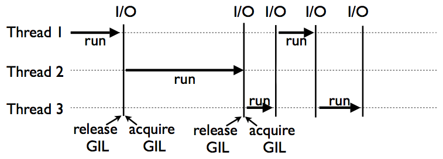

Note:
When a thread is running, it holds the GIL

GIL released on I/O (read,write,send,recv,etc.)


new slide

###Exécution multithreadée (CPU bound)

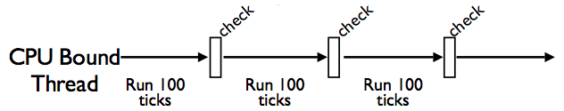

* Un "check" tous les 100 "ticks"
* *sys.setcheckinterval()*


new slide

##Que se passe-t-il durant un check?

1. Réinitialisation du compteur de ticks
1. Exécution des signal handlers (dans le <span style="text-decoration:underline;">main thread</span> seulement)
1. Libération du GIL
1. Obtention du GIL


new slide

###Implémentation (C)
```C
/* Python/ceval.c */
if (--_Py_Ticker < 0) {  /* Decrement ticks */
  ...
  _Py_Ticker = _Py_CheckInterval;  /* Reset ticks */
  ...
  if (things_to_do)
    if (Py_MakePendingCalls() < 0) {
      /* Run signal handlers */
    }

  if (interpreter_lock) {
    PyThread_release_lock(interpreter_lock);  /* Release the GIL*/

    /* Other threads may run now */

    PyThread_acquire_lock(interpreter_lock, 1);  /* Reacquire the GIL */
  }
```


new slide

##Un "tick"

* ne dépend pas d'une unité de temps
* peut être (très) long
* correspond (approximativement) à quelques instructions de bytecode


new slide

<p style="font-size: 400px; vertical-align: middle;">(</p>


new slide

1 "tick" d'environ 45 secondes (Intel Core i5 1.6GHz):

```python
>>> a = xrange(10**8)
>>> -1 in a
```


new slide

La même instruction suivi de l'envoi du signal SIGINT:

```python
>>> a = xrange(10**8)
>>> -1 in a
^C
```


new slide

zzzZZZzzzzzZZZZzzzzZZZzzzzzzZZZZ


new slide

45 secondes plus tard...

```python
>>> a = range(N)
>>> -1 in a
^C^C^C^C^C
Traceback (most recent call last):
    File "<stdin>", line 1, in <module>
KeyboardInterrupt
```


new slide

##Un "tick"

ne peut pas être interrompu


new slide

###Signaux et threads

Programmes multithreadés et signaux ne font pas (toujours) bon ménage


new slide

#Pourquoi?


new slide

Les signaux ne peuvent être handlés que dans le <span style="text-decoration:underline;">main thread</span>


new slide

Lors de la réception d'un signal, le main thread doit donc être exécuté au plus vite!


new slide

L'interpréteur effectue un check après chaque tick en espérant que le main thread soit schedulé rapidement:

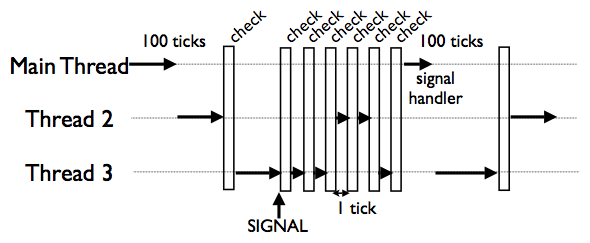

Note:
Python does not have a thread scheduler

There is no notion of thread priorities, preemption, round-robin scheduling, etc.

All thread scheduling is left to the OS

The reason Ctrl-C doesn't work with threaded programs is that the main thread is often blocked on an uninterruptible thread-join or lock

Since it's blocked, it never gets scheduled to run any kind of signal handler for it

And as an extra little bonus, the interpreter is left in a state where it tries to thread-switch after every tick (so not only can you not interrupt your program, it runs slow as hell!)


new slide

<p style="font-size: 400px; vertical-align: middle;">)</p>


new slide

###Expérience

Une fonction CPU bound:

```python
def count(n):
    while n > 0:
      n -= 1
```


new slide

et son exécution multithreadée:

```python
from threading import Thread

t1 = Thread(target=count, args=(10**8,))
t1.start()

t2 = Thread(target=count, args=(10**8,))
t2.start()

t1.join()
t2.join()
```


new slide

### Performances


new slide

2 cores: 30s


new slide

1 core: 22s


new slide

#?!


new slide

##L'implémentation du GIL
* Un mutex
* Une variable conditionnelle


new slide

### Pseudocode

```C
acquire() {
  mutex.acquire()
  while (locked)
    cond.wait(mutex)
  locked = 1
  mutex.release()
}

release() {
  mutex.acquire()
  locked = 0
  mutex.release()
  cond.signal()
}
```


new slide

###Thread switching

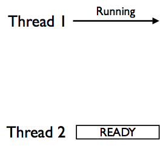

* Thread 1: état "élu" (en exécution)
* Thread 2: état "prêt" (en attente du GIL)


new slide

Cas simple, le thread 1 effectue une opération bloquante et relâche le GIL:

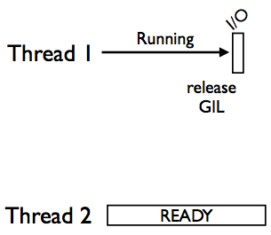


Note:
* Thread 1 might block so it releases the GIL


new slide

###Thread switching

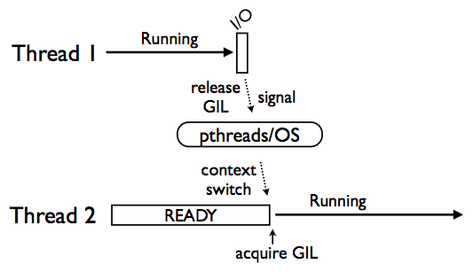

Note:
Release of GIL results in a signaling operation

Handled by thread library and operating system


new slide

### Thread switching

Cas délicat, les 2 threads sont à l'état "prêt":

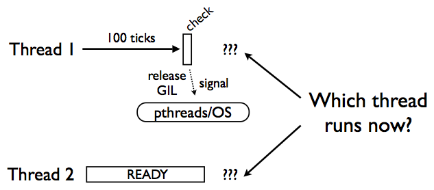

Note:
Either thread is able to run


new slide

### Les dessous d'une variable conditionnelle

Une file de threads:

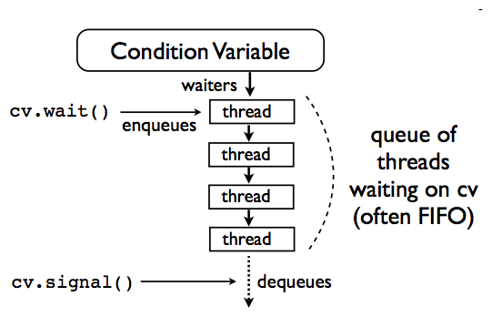

* *wait()* et *signal()* enfilent puis défilent un thread
* et ensuite?


new slide

### Scheduling

L'OS maintient une file de priorité de processus/threads prêts à être exécutés


new slide

Le thread venant d'être "signalé" rejoint cette file


new slide

L'OS exécute ensuite le processus/thread de plus haute priorité


new slide

Ce n'est pas obligatoirement le thread venant d'être "signalé"


new slide

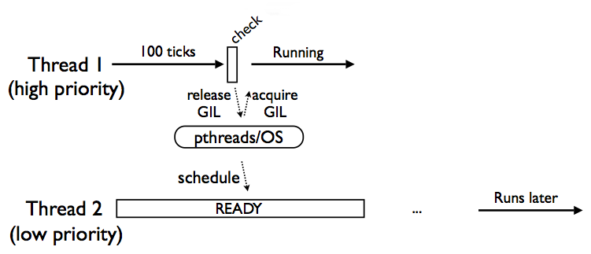

Note:
Thread 1 might keep going

Thread 2 moves to the OS "ready" queue and executes at some later time


new slide

### Thread switching

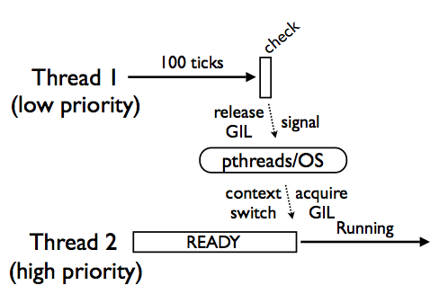

Note:
Again, highest priority wins


new slide

### L'expérience de David Beazley

Note:
instrumented Python with some logging

Recorded a large trace of all GIL acquisitions, releases, conflicts, retries, etc.

Goal was to get a better idea of how threads were scheduled, interactions between threads, internal GIL behavior, etc.


new slide

### GIL logging

```C
release() {
  mutex.acquire()
  locked = 0

  if (gil)
    log("RELEASE")

  mutex.release()
  cond.signal()
}
```


new slide

```C
acquire() {
  mutex.acquire()

  if (locked)
    log("BUSY")

  while (locked) {
    cond.wait(mutex)

  if (locked)
    log("RETRY")
  }

  locked = 1
  log("ACQUIRE")
  mutex.release()
}
```
Note:
logs are stored entirely in memory until exit (no I/O)


new slide

### Échantillon de la trace obtenue

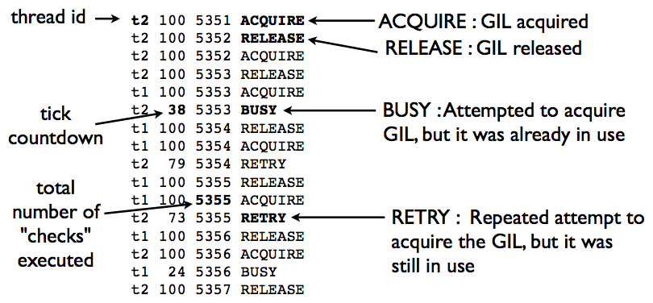


new slide

### Visualisation

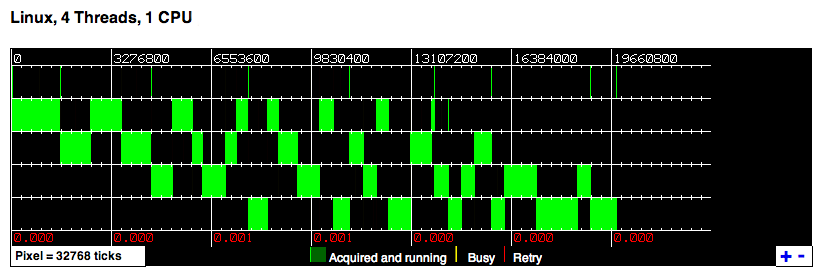


new slide

### Zoom

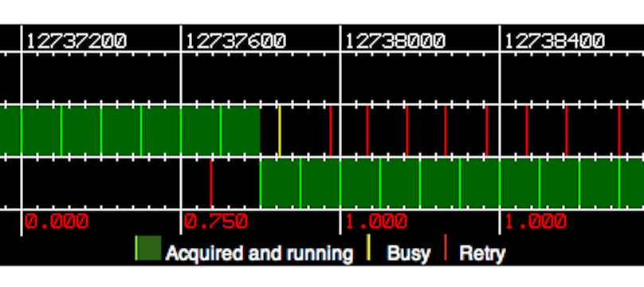


new slide

### Threading mono CPU

Une alternance entre threads moins fréquente qu'on ne l'imagine:

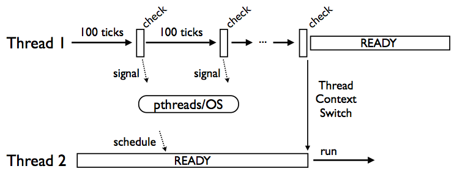

* Des centaines (voire des milliers) de checks peuvent avoir lieux avant un context switch

Note:
This is good!


new slide

### Cas typique

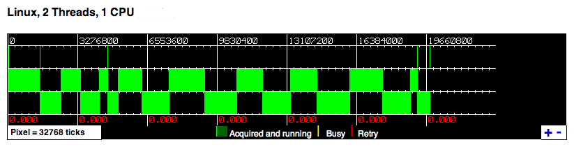


new slide

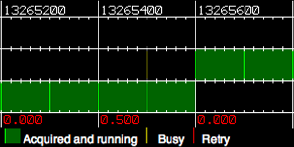


new slide

### Threading multi CPU


new slide

# C'est la guerre!


new slide

### La guerre du GIL

Avec plusieurs cores, plusieurs threads sont schedulés simultanément and se battent pour l'obtention du GIL:

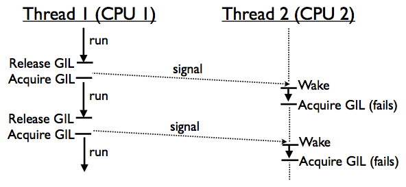

Note:
Thread 2 is repeatedly signaled, but when it wakes up, the GIL is already gone (reacquired)


new slide

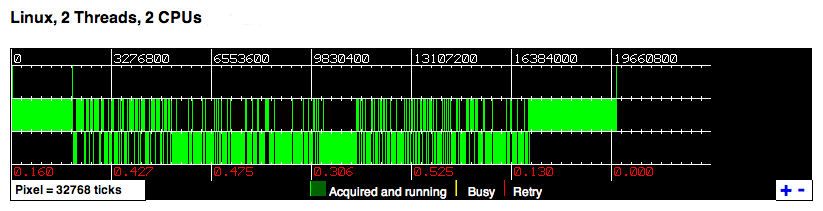


new slide

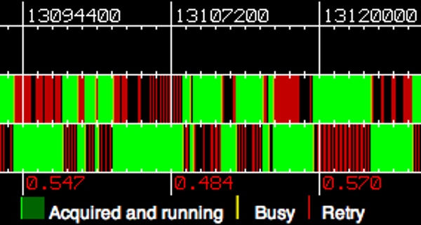


new slide

### La guerre du GIL

* Les threads CPU bound rendent l'obtention du GIL difficile pour les threads qui veulent gérer des évènements

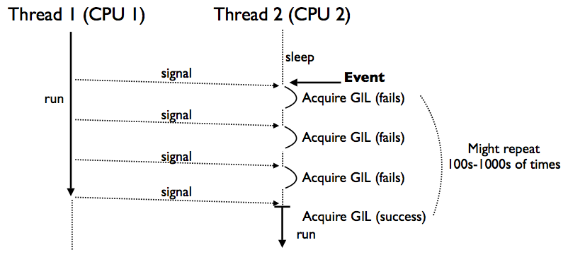

Note:
Race condition


new slide

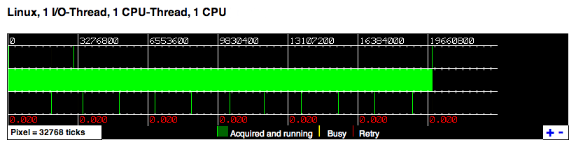


new slide

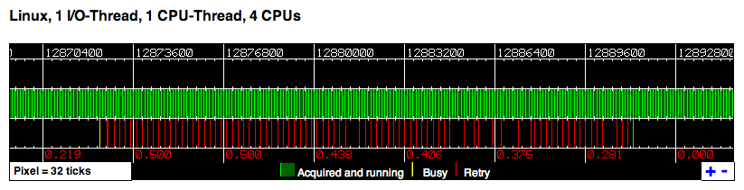


new slide

### I/O non bloquantes

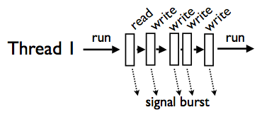

Note:
I/O ops often do not block

Due to buffering, the OS is able to fulfill I/O requests immediately and keep a thread running

However, the GIL is always released

Results in GIL thrashing under heavy load


new slide

# Merci!
